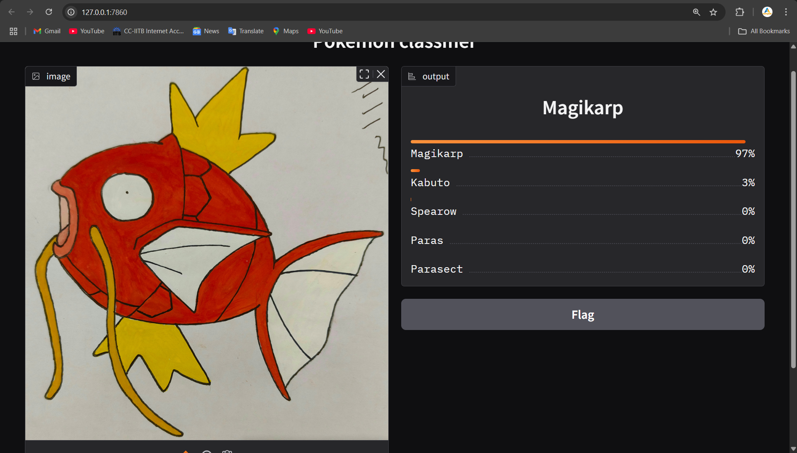

# "Week 5: Pokémon Image Classifier"  
  
### Introduction:  
The goal of this project was to train a model which can classify 1st generation PokéMon.  
  
### Dataset:  
The dataset contains images of PokéMon from 1st generation each in a folder of their respective names. There are around 25-50 images of each PokéMon. All of them with the PokéMon in the center.  
The dataset can be downloaded via the following link  
https://www.kaggle.com/datasets/lantian773030/pokemonclassification  
  
### Data Preprocessing:  
During preprocessing for training, the images are resized to 256x256, normalized to mean [0,0,0] and std. deviation [0.272, 0.272, 0.272].  
The augmentations applied are ColorJitter, RandomRotation and RandomHorizontalFlip.  
  
### Model Architecture:  
The architecture has 3 Convolution layers(3 -> 16, 16 ->32, 32 -> 64), each followed by a maxpool with ReLU as activation function.  
The CNN has 2 hidden layers (64*32*32 -> 512, 512 -> 256) with 512 nodes and 50% dropout.  
  
### Training Details:  
Loss Function used is CrossEntropyLoss and Optimizer used is SGD.  
The model was trained for 60 epochs with lr=0.01 and ReLU activation.  
Batch size was 64 with 80% of dataset used for training.  
  
### Key training metrics  
[Train loss and accuracy](images/test2.png)  
  
The model is saved in `week5/models` as `trained_model.pth` with only the state_dict instead of the entire model.  
  
### Results:  
The final test accuracy was around 59.45%  
As the number of images for per PokéMon was less the initial accuracy was low, adding BatchNorm in CNN architecture helped improve the accuracy by a lot.  

### Gradio Frontend:  
Run app.py(gradio interface) using  
`python app.py`  
  
### How to Run:  
**Virtual Environment(recommended for gradio)**  
Set-up a virtual environment using  
`python -m venv pokeml`  
Activate the virtual environment  
**Dependencies installation**  
Install required libraries using  
`pip install -r requirements.txt` (from the root directory)  
Download dataset from the above website and save it at data/raw/pokemon_images  
**Training the model**  
To train the model run(from root directory)  
`python scripts/train.py #argparse-arguments`  
The argparse arguments include  
    `--epochs`: number of epochs to train the model for (default=10)  
    `--batch_size`: the batch size for dataloader (default=64)  
    `--lr`: learning rate (default=0.01)  
    `--activation`: activation for convolution layers  
    `--save`: set True to save the trained model at models/trained_model.pth  
After training a graph showing Test Acc, Val Acc, Test Loss, Val Loss is shown  

**Predicting PokéMon using trained model**  
>**Note** : Only run this after saving the trained model  

To predict the model run(from root directory)  
`python scripts/predict.py --image_path IMAGE-PATH`  
image_path argument is required for model to predict the PokéMon  
**Predict via Interface (Gradio)**  
To predict the PokéMon by uploading image using an interface, run  
`python app.py`  
This will provide a local as well as an online link to the interface website. Simply upload the image and click Submit.  
