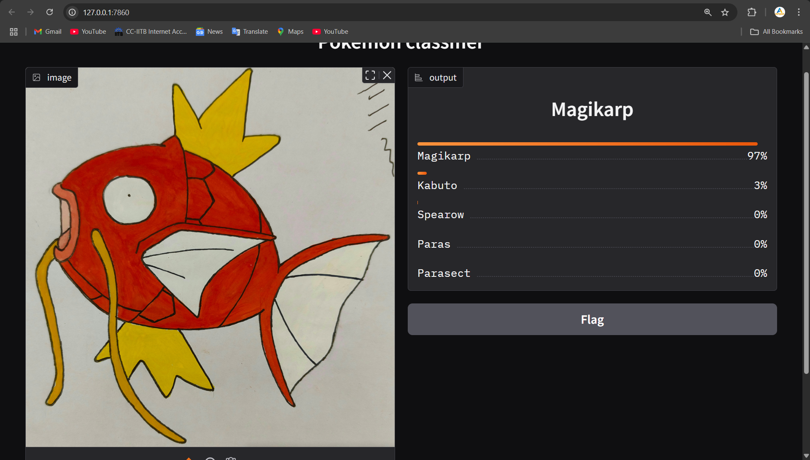

### "Week 5: Pokémon Image Classifier"

# Introduction: Briefly describe the project goal and what's implemented.
The goal of this project was to train a model which can classify 1st generation PokéMon.

# Dataset: Provide details about the dataset used, including where to download it (if not included in the repo) and its structure.
The dataset contains images of PokéMon from 1st generation each in a folder of their respective names. There are around 25-50 images of each PokéMon. All of them with the PokéMon in the center.
The dataset can be downloaded via the following link
https://www.kaggle.com/datasets/lantian773030/pokemonclassification

# Data Preprocessing: Explain the steps taken to preprocess the images (e.g., resizing, normalization, augmentation techniques used).
During preprocessing for training, the images are resized to 256x256, normalized to mean [0,0,0] and std. deviation [0.272, 0.272, 0.272]. The augmentations applied are ColorJitter, RandomRotation and RandomHorizontalFlip.

# Model Architecture: Describe your chosen CNN architecture. If using transfer learning, mention the pre-trained model and how you fine-tuned it.
The architecture has 3 Convolution layers(3 -> 32, 32 ->64, 64 -> 128), each followed by a maxpool with ReLU as activation function.
The CNN has 1 hidden layer with 512 nodes and 50% dropout.

# Training Details:
Loss Function used is CrossEntropyLoss and Optimizer used is Adam.
The model was trained for 30 epochs.
Batch size was 64 with 80% of dataset used for training.

# Key training metrics
[Train loss and accuracy](test1.png)

The model is saved in `week5/models` as `trained_model.pth` with only the state_dict instead of the entire model.

# Results:
(to be updated)
# Gradio Frontend:
Run app.py(gradio interface) using 
`python app.py`

# How to Run:
**Virtual Environment(needed for gradio)**
Set-up a virtual environment using
`python -m venv pokeml`
**Dependencies installation**
Install required libraries using
`pip install -r requirements.txt` (from the root directory)
Download dataset from the above website and save it at data/raw/pokemon_images
**Training the model** 
To train the model run(from root directory)
`python scripts/train.py #argparse-arguments`
The argparse arguments include
    1. --epochs: number of epochs to train the model for (default=10)
    2. --batch_size: the batch size for dataloader (default=64)
    3. --lr: learning rate (default=0.001)
    4. --activation: activation for convolution layers
    5. --save: set True to save the trained model at models/trained_model.pth
After training a graph showing Test Acc, Val Acc, Test Loss, Val Loss is shown
**Predicting PokéMon using trained model**
[Note] : Only run this after saving the trained model
To predict the model run(from root directory)
`python scripts/predict.py --image_path IMAGE-PATH`
IMAGE-PATH is required for model to predict the PokéMon
**Predict via Interface (Gradio)**
To predict the PokéMon by uploading image using an interface, run
`python app.py`
This will provide a local as well as an online link to the interface website. Simply upload the image and click Submit.
